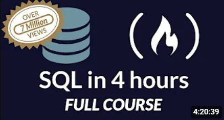

# Código em que estou aprendendo a utilizar SQL!

Estava seguindo a videoaula SQL Tutorial - Full Database Course for Begginners, do canal freeCodeCamp.org, para aprender os primeiros passos de como utilizar o MySQL, a partir da plataforma PopSQL (Código referente às informações desse vídeo estão em Aprendendo SQL - SQL for Begginners.sql)

Agora, depois dessa, estou seguindo a videoaula Data Analyst Bootcamp for Beginners, também do canal freeCodeCamp.org, para aprofundar meus conhecimentos básicos do primeiro vídeo em entendimentos mais avançados da linguagem (Código referente às informações desse vídeo estão em Aprendendo SQL - Data Analyst Bootcamp.sql)

